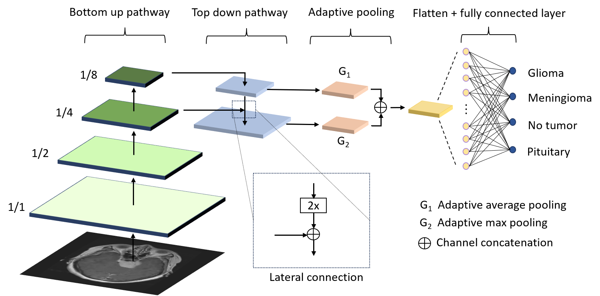
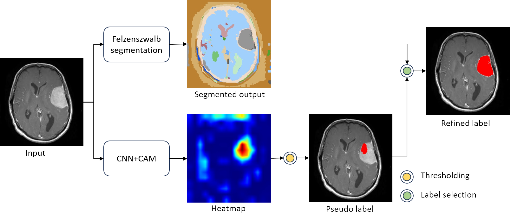

# Brain Tumor Diagnosis
This is the code base for my master's dissertation on 'Explainable Deep Learning for Brain Tumor Diagnosis'.

## Dataset
The [Brain tumor MRI dataset](https://www.kaggle.com/dsv/2645886) available was Kaggle was used to train the proposed network. The dataset consists of glioma, meningioma, pituitary and no tumor classes.

## Network Architecture
<div style="text-align: center;">
    
</div>

## Methodology
An explainable, lightweight convolutional neural network inspired by feature pyramid networks and attention mechanisms was developed to address the issue of explainability in brain tumor classification. Class activation mapping (CAM) is utilized to provide visual explanations for the model’s predictions. Additionally, a novel weakly supervised semantic segmentation (WSSS) method that combines class activation maps with graph-based segmentation is proposed to generate tumor masks.

## Training and Evaluation
This project is implemented in PyTorch. Use the notebook [BT_diagnosis_5CV.ipynb](Colab Notebooks/BT_diagnosis_5CV.ipynb) to train and evaluate the base model and the attention integrated models. 

## Usage

Follow these steps to run the models and view the class activation maps.

### Clone and install the dependencies
```bash
git clone https://github.com/krodri95/brain-tumor-diagnosis.git
cd brain-tumor-diagnosis
pip install -r requirements.txt
```

### Inference

`predict.py` runs inference on a single image and the results are saved to `exp/`. Select the model and the CAM technique.

```bash 
python predict.py --imgp assets/meningioma.jpg --model-type cbam --cam-type ScoreCAM
```


## Weakly Supervised Semantic Segmentation
<div style="text-align: center;">
    
</div>